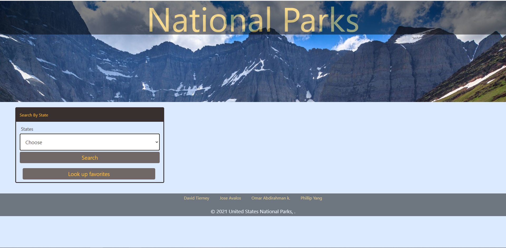

# U.S.-National-Parks
This weather Application helps users explore United States National Parks. As A user you will choose your Desired State and all the National parks in that State will display horizontally. When the Parks display you will Also get the local weather. There is a small discription about the Parks displayed and if you want to know more about it you might click on the Learn more and it will take you to that parks website. 

Technology: OpenWeather API, Tailwind CSS and National Park Service API.
Project Contributors: David T, Omar A,Phillip Y., Jose A. 

Deployed Link: https://cumar-khalif.github.io/U.S.-National-Parks/
Repository Link: https://github.com/Cumar-khalif/U.S.-National-Parks

